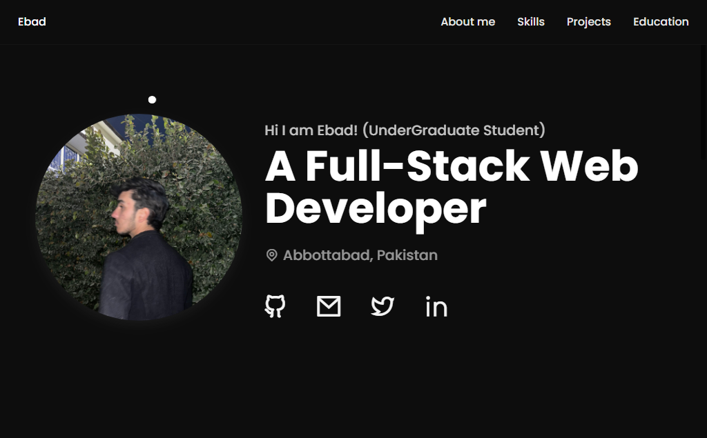

# 🌐 Personal Portfolio

 <!-- replace with actual screenshot path -->

[](https://edevbad.github.io/portfolio/)
---
---

## 📖 About
This is my **personal portfolio website**, built with **HTML, CSS, and JavaScript**.  
It showcases my skills, projects, and experience with a clean and responsive design.

---

## ✨ Features
- 🎨 Modern and minimal UI  
- 📱 Fully responsive across devices  
- 🖱️ Smooth animations & hover effects  
- 📂 Project section with tech stack & demo links  

---

## 🛠️ Tech Stack
- **HTML5**  
- **CSS3 (Flexbox, Grid, Animations)**  
- **Vanilla JavaScript (DOM, Events, Interactivity)**  

---

## 📂 Projects Highlighted
- 🔗 [**PopLynk**](https://poplynk.onrender.com): A modern URL shortener  
- 🎭 Interactive animations & transitions  
- 📊 Personal projects showcasing frontend skills  

---

## 🚀 Getting Started
```bash
# Clone the repository
git clone https://github.com/edevbad/portfolio.git

# Open index.html in your browser
```
## 📬 Contact

💼 LinkedIn  [Ebad Khan
](www.linkedin.com/in/ebad-khan-4a3ba5377)

📧 ebadk205@gmail.com

⭐ If you like this portfolio, don’t forget to star the repo!

---
